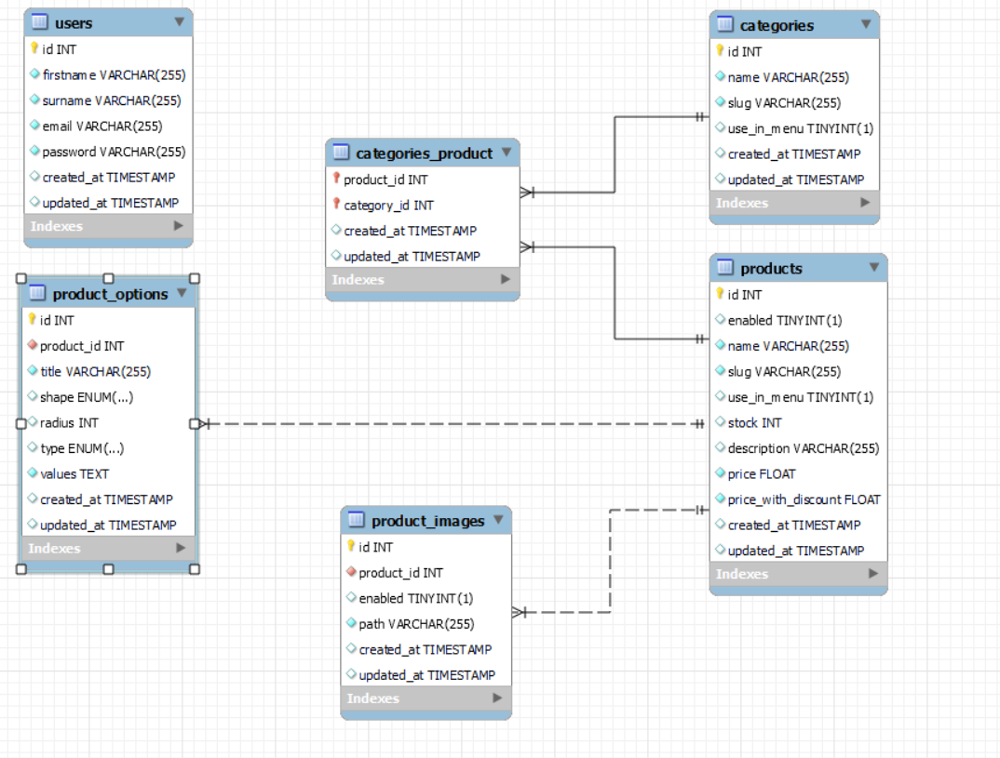

# Projeto-BackEnd

### Introdução:
Esta API foi desenvolvida pelos alunos do programa Geração Tech e tem como objetivo demonstrar o uso das habilidades adquiridas em sala de aula. A API foi baseada na documentação disponibilizada pela [Digital College](https://github.com/digitalcollegebr). Com esta API, é possível realizar pesquisas de dados cadastrados nas tabelas criadas, bem como inserir, atualizar e deletar dados. Este trabalho é resultado do bom desempenho em equipe e da valiosa tutoria da professora [Káthia Rocha](https://github.com/techcomkathia) e de [Nayara Calenzo](#), que nos acompanhou e deu suporte nesta importante tarefa.


### Equipe:

- **Lucas Teles** - [GitHub](https://github.com/magicianLucas)
- **Paulo** - [GitHub](https://github.com/paulomtx)
- **Pedro Matias** - [GitHub](https://github.com/PedroMatias1998)
- **Vinicius Alves** - [GitHub](https://github.com/Vicore123)
- **Mateus Souza** - [GitHub](https://github.com/MattSouza14)


## Sobre a API:

###
<details>
 <summary><strong>Tecnologias Implementadas no Projeto</strong></summary><br>

- *Node.js* - possibilita a execução JS em um servidor
- *Express.js* - Framework para criar rotas de API.
- *Dotenv* - Biblioteca para gerenciar variáveis de ambiente.
- *Nodemon* - Reinicia o servidor a cada alteração.
- *MySql* - Para a criação de tabelas, diagramas, inserts e consultas.
- *Railway* - Gerenciamento do banco de dados na nuvem.
- *MySQL12* - Driver MySQL necessário para Sequelize.
- *Sequelize* - ORM para manipular dados sql em JS
- *JWT* - Biblioteca para gerenciar tokens JWT.
- *JEST* - Framework de testes para JavaScript.
- *--save-dev* - Adiciona nodemon e jest

</details>

<details>
 <summary><strong>End Points: Usuários</strong></summary><br>

```
método: GET  
descrição: Retorna a estrutura de armazenamento que usa hashing para proteger informações, como senhas.
  
endpoint: http://localhost:8080/v1/users  

============================================================================================================================

método: GET  
descrição: Retorna o usuário pelo ID. Se o usuário for encontrado, o status da resposta é 200 com os dados do usuário.
 Se o usuário não for encontrado, o status da resposta é 404 com uma mensagem de erro.
 
endpoint: http://localhost:8080/v1/user/31  

============================================================================================================================

método: POST  
descrição: Cria um novo usuário. O corpo da solicitação deve conter os dados do usuário. Se a criação for bem-sucedida,
 o status da resposta é 201 com os dados do novo usuário.

endpoint: http://localhost:8080/v1/users  

============================================================================================================================

método: PUT  
descrição: Atualiza os detalhes de um usuário existente pelo ID. O corpo da solicitação deve conter os dados atualizados do
usuário. Se a atualização for bem-sucedida, o status da resposta é 200 com os dados atualizados do usuário.
Se o usuário não for encontrado, o status da resposta é 404.

endpoint: http://localhost:8080/v1/users/:id  

============================================================================================================================

método: DELETE  
descrição: Deleta um usuário pelo ID. Se a exclusão for bem-sucedida, o status da resposta é 204 e não há corpo de resposta.
 Se o usuário não for encontrado, o status da resposta é 404.

endpoint: http://localhost:8080/v1/users/:id  

============================================================================================================================

método: POST  
descrição: Realiza o login do usuário. O corpo da solicitação deve conter as credenciais do usuário (geralmente e-mail e senha).
 Se o login for bem-sucedido, o status da resposta é 200 com um token de autenticação. Se as credenciais estiverem incorretas,
 o status da resposta é 401.

endpoint: http://localhost:8080/v1/user/token  


```
  
</details>

<details>
 <summary><strong>End Points: Categorias</strong></summary><br>

```
método: GET  
descrição: Retorna uma lista de todas as categorias disponíveis.

endpoint: http://localhost:8080/v1/search  

============================================================================================================================

método: GET  
descrição: Retorna os detalhes de uma categoria específica pelo ID. Se a categoria for encontrada, o status da resposta é 200
com os dados da categoria. Se a categoria não for encontrada, o status da resposta é 404 com uma mensagem de erro.

endpoint: http://localhost:8080/v1/:id  

============================================================================================================================

método: POST  
descrição: Cria uma nova categoria. O corpo da solicitação deve conter os dados da nova categoria. Este endpoint requer um
token de autenticação. Se a criação for bem-sucedida, o status da resposta é 201 com os dados da nova categoria.

endpoint: http://localhost:8080/v1/create  

============================================================================================================================

método: PUT  
descrição: Atualiza os detalhes de uma categoria existente pelo ID. O corpo da solicitação deve conter os dados atualizados
da categoria. Este endpoint requer um token de autenticação. Se a atualização for bem-sucedida, o status da resposta é 200
com os dados atualizados da categoria. Se a categoria não for encontrada, o status da resposta é 404.

endpoint: http://localhost:8080/v1/:id  

============================================================================================================================

método: DELETE  
descrição: Deleta uma categoria pelo ID. Este endpoint requer um token de autenticação. Se a exclusão for bem-sucedida,
o status da resposta é 204 e não há corpo de resposta. Se a categoria não for encontrada, o status da resposta é 404.
 
endpoint: http://localhost:8080/v1/:id

```
  
</details>
<details>
 <summary><strong>End Points: Produtos</strong></summary><br>

```

método: GET  
descrição: Retorna uma lista de todos os produtos disponíveis.
  
endpoint: http://localhost:8080/v1/product  

============================================================================================================================

método: GET  
descrição: Retorna os detalhes de um produto específico pelo ID. Se o produto for encontrado, o status da resposta é 200.
Se o produto não for encontrado, o status da resposta é 404 com uma mensagem de erro.

endpoint: http://localhost:8080/v1/product/:id  

============================================================================================================================

método: POST  
descrição: Cria um novo produto. O corpo da solicitação deve conter os dados do produto.
Se a criação for bem-sucedida, o status da resposta é 201 com os dados do novo produto.

endpoint: http://localhost:8080/v1/createproduct  

============================================================================================================================

método: DELETE  
descrição: Deleta um produto pelo ID. Se a exclusão for bem-sucedida, o status da resposta é 204 e não há corpo de resposta.
Se o produto não for encontrado, o status da resposta é 404.

endpoint: http://localhost:8080/v1/product/:id

```
  
</details>

<details>
 <summary><strong>Instruções de aplicação e uso da API</strong></summary><br>
 
Realize o clone do projeto e instale as seguintes dependências:

```
npm install express dotenv nodemon sequelize mysql2 jsonwebtoken jest --save-dev
```

Abra o terminal integrado no arquivo server.js e execute o seguinte comando para abrir a porta:

```
node --env-file=../.env server.js
```

Para uma experiência mais completa e facilitada com nossa API, recomendamos o uso do [Postman](https://www.postman.com/), ferramenta utilizada para explorar, testar e interagir com os endpoints da API de forma e eficiente.

</details>


## Diagrama do Banco de Dados:




## Estrutura de diretório:
```
project-root/
├── src/
│   ├── config/
│   ├── controllers/
│   ├── middleware/
│   ├── models/
│   ├── routes/
│   ├── services/
│   ├── app.js
│   └── server.js
├── tests/
├── .env
├── .gitignore
└── package.json
```

## Considerações Finais: 
Este projeto foi um desafio que nos colocou sob pressão, e sua realização é um reflexo do comprometimento que tivemos durante toda a jornada. Levaremos conosco tanto os erros quanto os acertos, e o aprendizado adquirido ao longo do processo nos abrirá novas portas.

