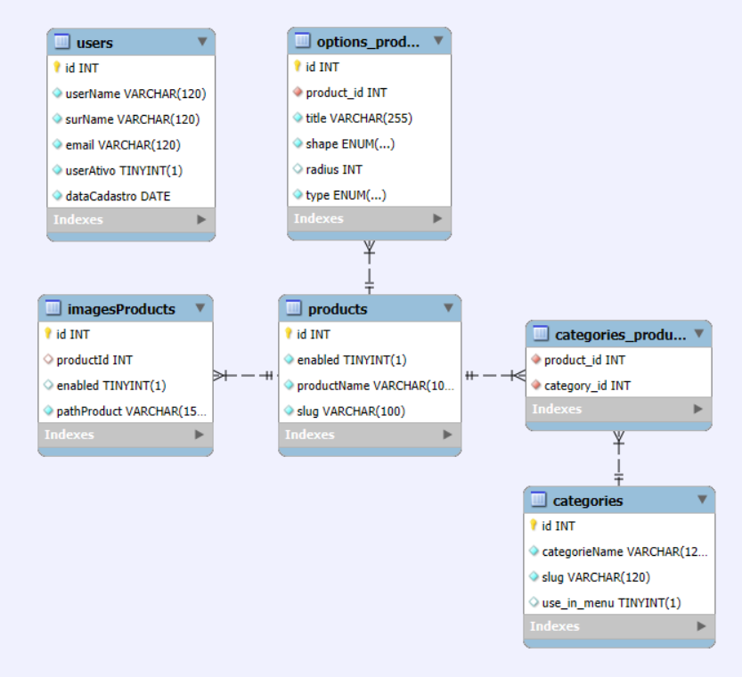

# Projeto-BackEnd

### Sobre o Projeto:
Este é um projeto de Back-End desenvolvido pelos alunos do programa Geração Tech e tem como objetivo demonstrar o uso das habilidades adquiridas em sala de aula. A realização deste trabalho se deve ao bom desempenho em equipe e à valiosa tutoria da professora [Káthia Rocha](https://github.com/techcomkathia) e [Nayara Calenzo](#) que nos acompanhou e deu suporte nesta importante tarefa.

### Equipe:

- **Lucas Teles** - [GitHub](https://github.com/magicianLucas)
- **Paulo** - [GitHub](https://github.com/paulomtx)
- **Pedro Matias** - [GitHub](https://github.com/PedroMatias1998)
- **Vinicius Alves** - [GitHub](https://github.com/Vicore123)
- **Mateus Souza** - [GitHub](https://github.com/MattSouza14)

###
<details>
 <summary><strong>Tecnologias Implementadas no Projeto</strong></summary><br>

- *Node.js* - possibilita a execução JS em um servidor
- *Express.js* - cria as rotas de API
- *Dotenv* - cria configurações com mais facilidade e segurança
- *Nodemon* - reinicia o servidor a cada alteração
- *MySQL* para persistência de dados
- *Sequelize* - manipular dados sql em JS
- *JWT* - adiciona segurança e limita o acesso nas rotas de API
- *JEST* - testar e manter a qualidade do código
</details>


### Diagrama do Banco de Dados:




### Estrutura de diretório:
```
project-root/
├── src/
│   ├── config/
│   ├── controllers/
│   ├── middleware/
│   ├── models/
│   ├── routes/
│   ├── services/
│   ├── app.js
│   └── server.js
├── tests/
├── .env
├── .gitignore
└── package.json
```
